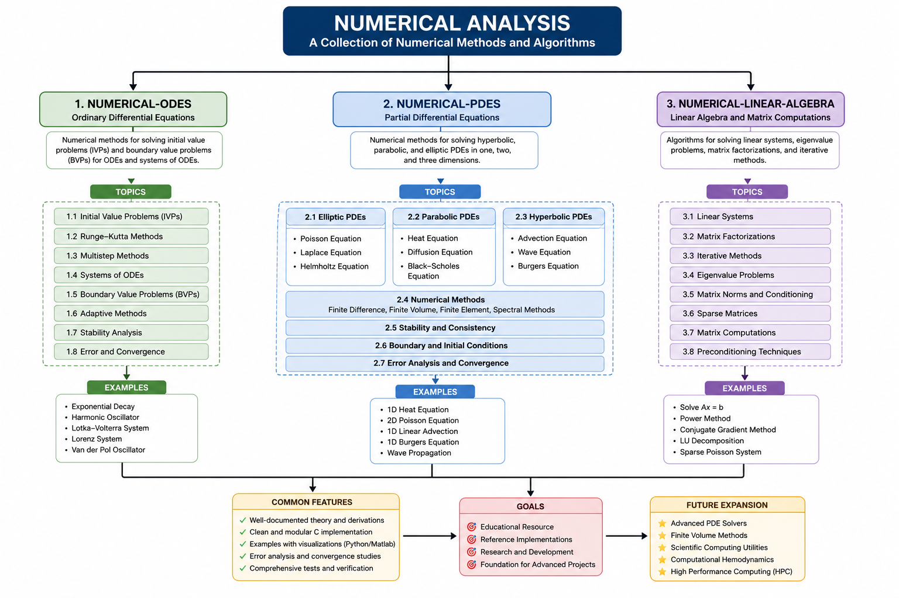

# Numerical Computing Series

A collection of professionally written lesson-based resources covering numerical computing through mathematical theory, algorithms, programming implementations, and real-world applications.

**Author:** Dr. Shuruq Alnefaie

## Repository Structure

- [Numerical ODEs](ode/)
- [Numerical PDEs](pde/)
- [Numerical Linear Algebra](linear-algebra/)

## Roadmap

## Languages

- C for numerical implementations
- Python for visualization, validation, and convergence studies

## Project Goals

- Provide clear implementations of classical numerical methods
- Connect mathematical theory with working code
- Include examples, tests, and visualizations
- Build a reusable reference for students and researchers

## Planned Topics

### Ordinary Differential Equations

- Forward Euler
- Backward Euler
- Heun’s Method
- Midpoint Method
- Runge–Kutta Methods
- Multistep Methods

### Partial Differential Equations

- Heat Equation
- Wave Equation
- Advection Equation
- Poisson Equation
- Burgers’ Equation

### Numerical Linear Algebra

- Gaussian Elimination
- LU Decomposition
- Cholesky Factorization
- Jacobi Method
- Gauss–Seidel Method
- Conjugate Gradient
- GMRES
- Eigenvalue Methods

## Status

This repository is currently under development.

## License

This project is licensed under the MIT License.
